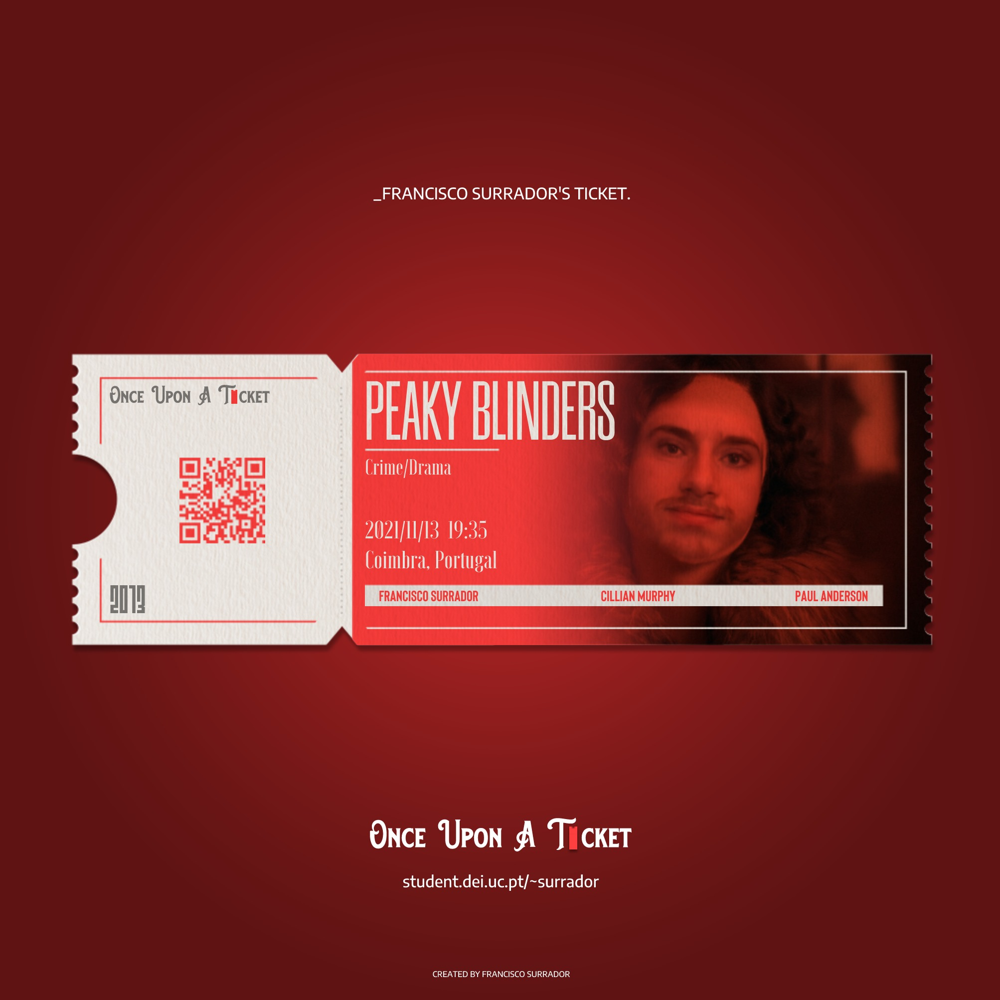

# **Once Upon A Ticket**

### **What is "Once Upon a Ticket?"**

The platform I decided to implement is a website, which contains a **movie ticket generator** custom to each user. The main objective is sharing on social media, however I thought it would make sense to use the gallery section for full consultation of the artefacts already generated.
The site will have three sections: “Home”, which redirects to the landing page; “About”, which contextualizes the project and its functioning from the first to the last stage; ”Gallery”, which will contain all tickets generated by users who chose to save their generated result. This last section is not yet implemented, however in Stage 3 it will be part of the requested documentation.

### **Context**

### **What you get**

### [Test the plaftorm here!](https://student.dei.uc.pt/~surrador/Gerador%20de%20Bilhetes/)

### **What was used**

The website was programmed using HTML, CSS and JavaScript languages, and is located on the dei.uc.pt servers, so that an online version can be made available. The main languages used in its development were HTML, CSS and Javascript, also using the “p5.js”, “jQuery” and “jsPDF” libraries.

p5js: <https://p5js.org/>

jQuery: <https://api.jquery.com/>

jsPDF: <https://github.com/parallax/jsPDF>

### **How to run**

All the dependencies you need is your functional webcam! You also need to allow Chrome or Safari to know your location in your system preferences.

### **Contact**

Francisco Surrador

fsurrador@gmail.com

